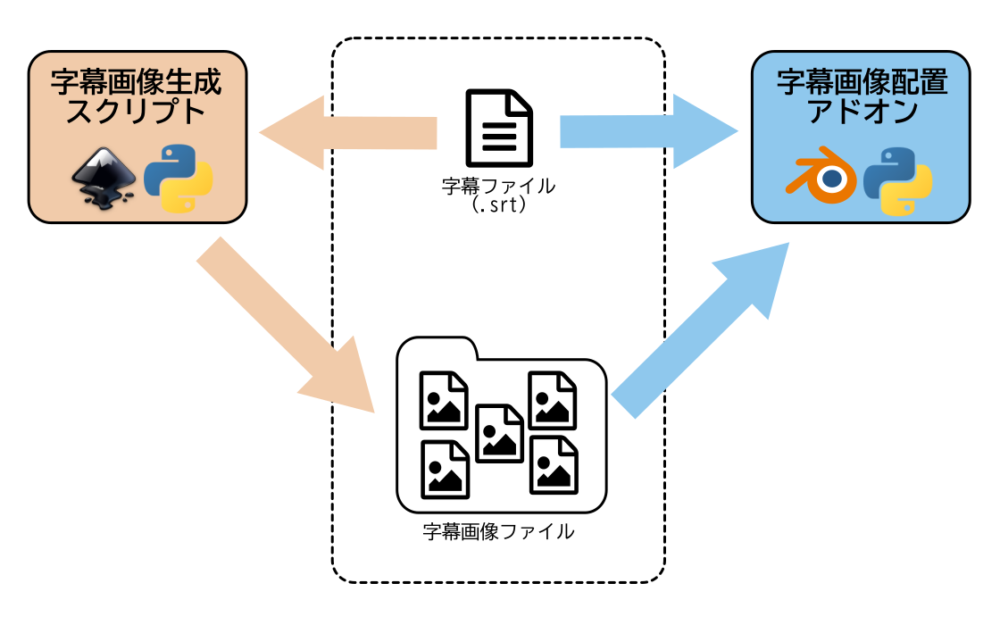

# srt_loader

SubRip形式の字幕ファイルと画像格納ディレクトリから、対応するイメージ画像を画像ストリップとして追加するBlenderアドオン

## 前提

このツールはDIY(大体で良いからやってみた)で作成しています。 今後、DIYでなく、ちゃんとしたアドオンにしてきたいと思っています。

本アドオン(下図の右側)は、[kantas-spike/create-subtitle-image](https://github.com/kantas-spike/create-subtitle-image)(下図の左側)により生成した字幕画像を、VSEのイメージストリップとして追加します。

現状では、事前(またはBlenderの操作中)に[kantas-spike/create-subtitle-image](https://github.com/kantas-spike/create-subtitle-image)を実行してから、本アドオンを利用する必要があります。



## インストール方法

1. Blenderのアドオンディレクトリにプロジェクトをクローンする。

    - macOSの場合

    ```shell
    cd ~/Library/Application Support/Blender/<blender_version>/scripts/addons
    git clone https://github.com/kantas-spike/srt_loader.git
    ```

3. Blenderを起動し、`Preferences`-`Add-ons`から`Sequencer: .srt Loader`をチェックして有効にします。


## 使い方

### はじめに

以下の字幕ファイルと字幕画像を例に操作方法を説明します。

- 字幕ファイル [sample.srt](https://github.com/kantas-spike/create-subtitle-image/blob/main/sample_srt/sample.srt)

    ```txt
    1
    00:00:02,000 --> 00:00:08,000
    字幕ファイルから
    字幕画像を生成します

    2
    00:00:10,000 --> 00:00:18,000
    一重、二重の縁取り文字を作成できます

    3
    00:00:20,000 --> 00:00:28,000
    影付きやボックスありの
    字幕も作成できます
    ```

- 字幕画像ディレクトリ [sample_output/06](https://github.com/kantas-spike/create-subtitle-image/tree/main/sample_output/06)

|ファイル名|字幕画像|
|---|---|
| 1.png |  |
| 2.png |  |
| 3.png |  |

### 操作手順

1. Blenderを起動し、`File`-`New`-`Video Editing`からVSEを開きます。
2. `Video Sequencer`の右側に`Subtitle Images`タブが表示されます。

    

3. `Subtitle Images`タブを選択し、`追加`ボタンをクリックします。

    

4. 入力欄が表示されるので、`字幕ファイル(.srt)`と`字幕画像格納ディレクトリ`のパスを設定します。

    

5. 字幕画像を追加するチャンネルや配置する位置を調整して、`字幕画像を読み込む`ボタンをクリックします。

    

6. 字幕ファイルに定義された位置に字幕画像が配置されます。

    
