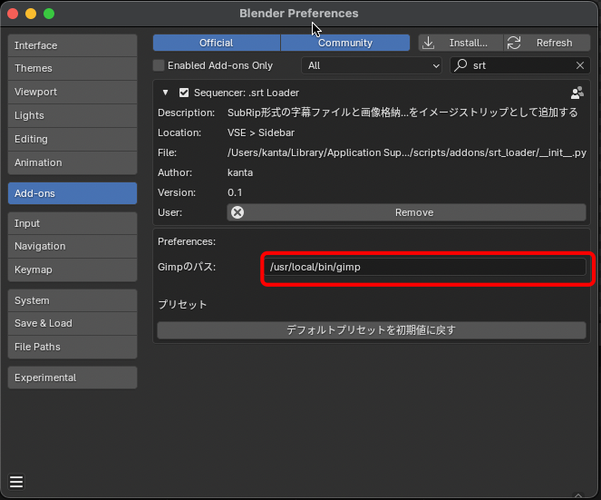

# .srt loader

SubRip形式の字幕データからGIMPを使って字幕画像を生成し、画像ストリップとして追加するBlenderアドオン

## 前提

本アドオンは、[GIMP - GNU Image Manipulation Program](https://www.gimp.org/)を利用して、字幕画像を生成します。
そのため、事前にGIMPをインストールする必要があります。

そして、`.srt loader`アドオンのプリファレンスにGIMPコマンドのパスを設定する必要があります。



GIMPコマンドのパスのデフォルト値は以下になります。

ご利用の環境にあわせて、GIMPコマンドのパスを指定してください。

```shell
/usr/local/bin/gimp
```

## インストール方法

1. Blenderのアドオンディレクトリにプロジェクトをクローンする。

   - macOSの場合

   ```shell
   cd ~/Library/Application Support/Blender/<blender_version>/scripts/addons
   git clone https://github.com/kantas-spike/srt_loader.git
   ```

2. Blenderを起動し、`Preferences`-`Add-ons`から`Sequencer: .srt Loader`をチェックして有効にします。

## 使い方

以下の使い方について説明します。

1. あらかじめ用意した字幕ファイルから字幕画像を生成する方法
2. 字幕ファイルを新規作成し、字幕データを更新しながら字幕画像を生成する方法

### あらかじめ用意した字幕ファイルから字幕画像を生成する方法

以下の字幕ファイルを例に操作方法を説明します。

- 字幕ファイル [sample.srt](https://github.com/kantas-spike/create-subtitle-image/blob/main/sample_srt/sample.srt)

  ```txt
  1
  00:00:02,000 --> 00:00:08,000
  字幕ファイルから
  字幕画像を生成します

  2
  00:00:10,000 --> 00:00:18,000
  一重、二重の縁取り文字を作成できます

  3
  00:00:20,000 --> 00:00:28,000
  影付きやボックスありの
  字幕も作成できます
  ```

操作手順は以下になります。

1. Blenderを起動し、`File`-`New`-`Video Editing`からVSEを開きます。
2. `Video Sequencer`の右側に`Subtitle Images`タブが表示されます。
3. `Subtitle Images`タブを選択し、`.srt loader`アドオンのパネルを表示します。
4. `Source`パネルの`Srt File`入力欄から`字幕ファイル(.srt)`のパスを設定します。
5. `Source`パネルの`Srt File読み込み`ボタンをクリックし、ファイルから字幕データを読み込みます。
6. `字幕情報`パネルのリストに字幕データが表示されます。
7. `字幕情報`パネルの`字幕画像の一括作成`ボタンをクリックすると字幕画像が生成され、タイムラインに追加されます。
   (字幕画像生成には、少し時間がかかります。ゴメンなさい...)

   1. 字幕画像のスタイルは`デフォルトスタイル`パネルで変更できます。
      1. スタイルには以下の項目があり、個別に変更することができます。
         - テキスト設定
         - 縁取り設定
         - Shadow設定
         - Box設定
         - Padding設定
      2. スタイルには予め用意されたプリセットがあり、プリセットを選択し、
         `プリセットの内容をスタイルに反映`ボタンをクリックすると、プリセットの内容が各設定に反映されます。
      3. スタイルの変更後に、再度、`字幕情報`パネルの`字幕画像の一括作成`ボタンをクリックすると字幕画像が再生成されます。
         (字幕画像生成には、少し時間がかかります。ゴメンなさい...)
   2. 字幕画像が配置されるチャンネルやプレビュー内での位置は、`デフォルトのチャンネルと位置`パネルで変更できます。
      1. `Selected Strip→Properties`ボタンをクリックすると、選択した字幕画像のチャンネルや位置が設定に反映されます。
      2. 設定変更後に、`字幕情報`パネルの`字幕画像の一括再配置`ボタンをクリックすると、字幕画像が再配置されます。
         (`字幕画像の一括作成`ボタンをクリックした場合は、字幕画像を再作成後に変更された設定で再配置されます。)

8. もし、字幕データで個別の`スタイル`を設定したい場合は、以下の手順で設定します。
   1. `字幕情報`パネルのリストから個別にスタイルを設定したい行を選択します。
   2. 表示される`字幕スタイル`パネルのチェックをONにします。
   3. `字幕スタイル`パネルで、個別のスタイルを設定します。設定方法は`デフォルトスタイル`パネルと同様です。
   4. `テキストと時間`パネルの`字幕画像の作成`ボタンをクリックすると、該当字幕のみ字幕画像が再作成されます。
9. もし、字幕データで個別の`チャンネルと位置`を設定したい場合は、以下の手順で設定します。
   1. `字幕情報`パネルのリストから個別にスタイルを設定したい行を選択します。
   2. 表示される`チャンネルと位置`パネルのチェックをONにします。
   3. `チャンネルと位置`パネルで、設定を変更します。設定方法は`デフォルトのチャンネルと位置`パネルと同様です。
   4. `テキストと時間`パネルの`字幕画像の再配置`ボタンをクリックすると、該当字幕のみ字幕画像が再配置されます。
10. 字幕データ個別のスタイルや位置などの設定を字幕ファイルに反映するには、`Source`パネルの`Srt Fileへの保存`ボタンをクリックします。
    (個別の設定が、srtファイルに保存されます。ただし、標準のSubRip形式では個別設定を保存できないため、SubRip形式を拡張した独自の形式で保存されます。)

### 字幕ファイルを新規作成し、字幕データを更新しながら字幕画像を生成する方法

`.srt loader`アドオン内で、字幕ファイルを新規作成する方法を説明します。

操作手順は以下になります。

1. Blenderを起動し、`File`-`New`-`Video Editing`からVSEを開きます。
2. `Video Sequencer`の右側に`Subtitle Images`タブが表示されます。
3. `Subtitle Images`タブを選択し、`.srt loader`アドオンのパネルを表示します。
4. `Source`パネルの`Srt File`入力欄から`字幕ファイル(.srt)`のパスを設定します。
   今回はファイルを新規作成するため、存在しないファイルパス(例:`//test.srt`)を指定してください。
   (ファイルパスのプレフィックス`//`は、Blender独自の相対パス形式になります。`//`で始まるパスは`.blend`ファイルのパスからの相対パスになります。)
5. `字幕情報`パネルのリストの`追加`ボタンをクリックします。
6. リストに1行追加され、該当行に対応する`テキストと時間`、`チャンネルと位置`、`字幕スタイル`パネルが表示されます。
7. また、`テキストと時間`パネルにはデフォルトで`テキスト`という字幕が設定されます。
8. 字幕の文言の修正は以下の手順で行います。
   1. `テキストと時間`パネルの`編集`ボタンをクリックします。
   2. すると、テキストエディターが起動するので文言を編集します。
      **ただし、Blenderのテキストエディターは、日本語を入力できません。あらかじめメモ帳などで入力した文言をコピーして、テキストエディターにペーストしてご利用下さい。**
   3. 保存する場合は、右側下部にある`字幕編集`パネルの`保存`ボタンを、キャンセルする場合は、`キャンセル`ボタンをクリックしてください。
9. `テキストと時間`パネルの`字幕画像の作成`ボタンをクリックすると、編集した文言で字幕画像が作成されます。
10. デフォルトでは、`字幕情報`パネルのリストの`追加`ボタンをクリックした時のプレイヘッドの位置に120フレームの長さで字幕画像が配置されます。
    字幕の開始位置と長さを修正する場合は以下の手順で行います。
    1. タイムライン上で該当字幕画像ストリップの位置と長さを修正
    2. `テキストと時間`パネルの`Strip→プロパティー`ボタンをクリックし、字幕の開始位置と長さを反映
11. 5〜10の手順を繰替えして必要な字幕データを作成します。
12. `Source`パネルの`Srt Fileへの保存`ボタンをクリックし、字幕ファイルに保存します。
